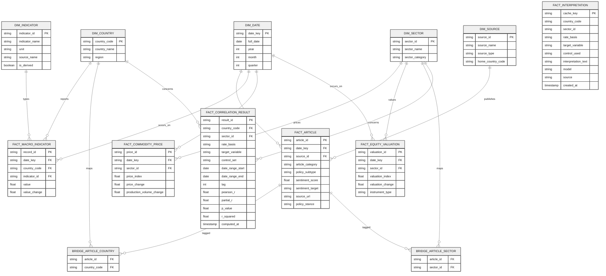
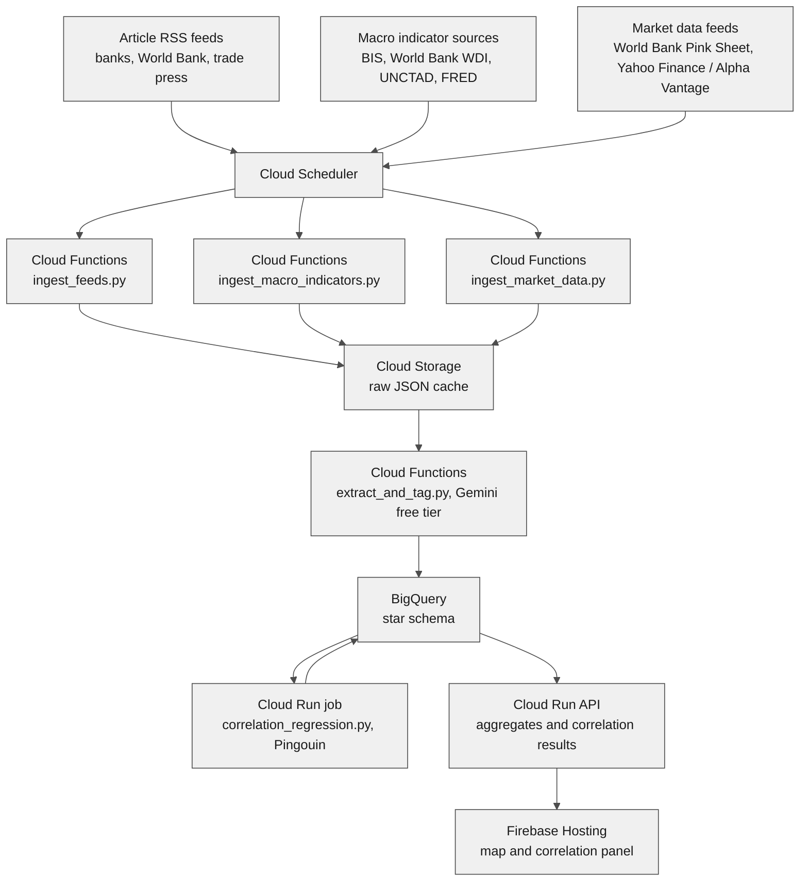
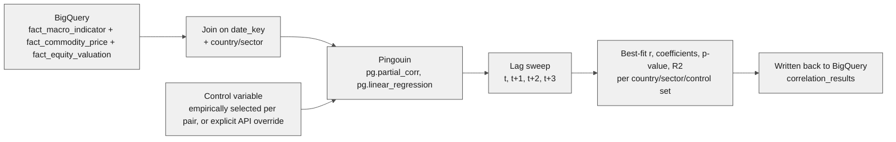

# Monetary Policy Commodities Correlation (mp-commodities-corr): AI-Driven Monetary Policy Tracker with Quantitative Correlation Analysis for Metal Commodities and Semiconductor Supply Chains

**Live:** [mp-commodities-corr.web.app](https://mp-commodities-corr.web.app)

---

## Project Description

**mp-commodities-corr** is a serverless web application that continuously scrapes monetary policy news — including market regulation as a subtype rather than a separate category — from central banks, the World Bank Group, MNC banks, commodity exchanges, and trade press, then classifies and geolocates that news by country. Articles are split into two top-level categories at classification time — **monetary policy** and **commodity stocks** — with commodity-stocks articles atomized down to the specific metal or semiconductor commodity they concern (copper, lithium, nickel, rare earths, cobalt, semiconductors), rather than left as a general "metals vs. semiconductors" bucket. Alongside the news layer, it ingests a configurable set of macroeconomic control variables (interest rates, FDI, inflation, GDP growth, unemployment, trade balance, exchange rate, government debt, and global rate spillover) plus commodity price and sector equity valuation time series, and runs statistical correlation and regression analysis (via Pingouin) between rate changes and commodity/sector valuation — the underlying `/api/correlation` endpoint empirically selects whichever single control variable most strengthens each result (or accepts an explicit `control` override), rather than assuming one variable (e.g. FDI) matters for every pair, and a Gemini-generated plain-language interpretation of that specific result is layered on top, cached and with a rule-based fallback so the panel never breaks if the LLM call fails. It renders a live world choropleth showing where policy activity is concentrated, with a correlation panel surfacing the quantitative relationship — filterable by country, sector (via a dedicated sector-valuation dropdown), rate basis, and target variable — with a plain-language interpretation of that specific result's own numbers (direction, strength, significance, R², lag), and the monetary-policy/commodity-stocks RSS feed for the selected country alongside the map. The system is designed to run entirely within Google Cloud Platform's Always Free tier.

**Scope note (metals, not precious metals):** the six tracked sectors — copper, lithium, nickel, rare earths, cobalt, semiconductors — are industrial/EV/tech-supply-chain commodities chosen because they're plausibly rate-sensitive through the transmission channels below (financing cost of inventory, extraction economics, substitution into yield-bearing assets). Gold and silver are deliberately out of scope: they trade primarily as monetary/safe-haven assets, not industrial inputs, and the World Bank Pink Sheet does carry them (`Gold`, `Silver`, `Platinum` columns) if a future iteration wants to test the same methodology against precious metals — it isn't a data-availability gap, just a scope boundary.

---

## Tech Stack

| Category                | Tools / Services                                                |
| ------------------------ | ----------------------------------------------------------------- |
| **Programming Language** | Python 3.11 (backend, ETL, analysis), JavaScript (frontend)       |
| **Ingestion**            | `feedparser`, Cloud Scheduler, Cloud Functions                    |
| **Extraction / NLP**     | Gemini API via Google AI Studio, free tier (structured JSON extraction, category/sector/sentiment tagging) |
| **Statistical Analysis** | Pingouin (correlation, multiple linear regression, partial correlation with a variable set of controls), pandas, numpy; scikit-learn (`LassoCV` multi-feature ML regression, `LogisticRegression` predictive sentiment classifier — notebook-only, see Notebooks) |
| **Structured Storage**   | BigQuery (star schema: fact + dimension tables) in production; DuckDB (same schema/SQL) for local dev — `common/db.py` picks the backend |
| **Object Storage**       | Cloud Storage (raw article and time series JSON cache)            |
| **Backend / API**        | FastAPI on Cloud Run                                               |
| **Data Export**          | pandas (CSV/XLSX), `openpyxl` (XLSX), `reportlab` (PDF) — isolated in a separate Cloud Run service from the main API |
| **Geospatial**           | Natural Earth country polygons, Leaflet.js                        |
| **Typography**           | DM Sans (UI text) / DM Mono (data, stats) via Google Fonts, Fraunces for serif headlines |
| **GIS Mapping**          | OpenStreetMap tiles, Leaflet.js choropleth                         |
| **Frontend Hosting**     | Firebase Hosting                                                   |
| **Orchestration**        | Cloud Scheduler (cron-style polling, no persistent server)         |
| **Infra as Code**        | Terraform                                                          |
| **CI/CD**                | GitHub Actions                                                     |
| **Development Tools**    | Jupyter Notebook (exploration), Cloud Logging (monitoring)         |

---

## Solution Pathways

mp-commodities-corr improves visibility into commodity-adjacent monetary policy risk by:

- Continuously polling central bank, World Bank Group, MNC bank, commodity exchange, and trade-press RSS feeds.
- Classifying each article into one of two top-level categories — monetary policy or commodity stocks — with commodity-stocks articles atomized to the specific commodity involved, plus country, monetary policy subtype (where applicable), and sentiment.
- Ingesting a configurable set of macroeconomic control variables alongside commodity price and sector equity valuation time series.
- Running correlation and regression analysis (Pingouin) between interest rate changes and commodity/sector valuation, with the API supporting an arbitrary control-variable set per request.
- Filtering the map and correlation panel by commodity sector through a dedicated sector-valuation dropdown, rather than requiring one country click at a time to find a given sector.
- Surfacing each transmission mechanism's live-RSS support as a percentage of currently tagged articles for the selected country, linked back to the source outlet as evidence.
- Mapping policy activity and correlation strength onto a live world choropleth.
- Running the full pipeline within free-tier serverless quotas — no always-on server required.

**Solution Features:**

| Feature Type  | Feature Description                                                                 |
| ------------- | ------------------------------------------------------------------------------------ |
| **Core**      | Two-category article classification (monetary policy / commodity stocks, atomized per commodity); correlation and regression against an API-selectable control-variable set |
| **Enabling**  | World choropleth of policy activity filterable via a sector-valuation dropdown; correlation panel filterable by country/sector/target variable/rate basis |
| **Enhancing** | Feed health monitoring, classification confidence tracking, click-through to source articles, local RSS-volume simulation for testing, plain-language interpretation of each result's own numbers |

---

## Introduction & Project Context

### Problem Statement

Monetary policy shifts affecting metal commodities and semiconductor supply chains are currently tracked manually or through fragmented, single-source news alerts, with little tooling connecting policy news to the actual quantitative relationship between rate changes and commodity valuation — and what tooling exists rarely lets an analyst control for more than one confounding factor at a time, or separate "this article is about the policy decision" from "this article is about the commodity's market performance."

mp-commodities-corr addresses this by applying LLM-based structured extraction to continuously scraped RSS content — splitting articles into monetary policy vs. commodity stocks categories, atomized to the specific commodity — while separately ingesting policy rate, control-variable, and valuation time series and running statistical correlation/regression between them, with the control variable set left to the user rather than fixed.

**Target Users:** Individual analysts, small research teams, and students tracking commodity and semiconductor policy risk who need a lightweight, always-current reference tool rather than an enterprise terminal subscription.

### Market Scope & Industry Context

Commercial terminals (Bloomberg, Refinitiv) already offer commodity and policy news aggregation plus quantitative analytics, but at a price point and complexity level aimed at institutional trading desks. There is a gap for a lightweight, free-to-run, geographically organized tool aimed at smaller teams, researchers, or students who need directional awareness and a basic, adjustable quantitative correlation view rather than trading-grade data feeds. Precise market-sizing figures (TAM/SAM/SOM) for this narrower niche were not sourced for this document — a follow-up research pass against named market reports would be needed before using specific dollar figures in any pitch material, rather than asserting placeholder numbers here.

### Research Objectives

1. Continuously ingest RSS feeds from central banks, the World Bank Group, MNC banks, commodity exchanges, and semiconductor trade press without operating a persistent server.
2. Classify each article into monetary policy or commodity stocks (atomized to the specific commodity), country, monetary policy subtype where applicable, and sentiment via LLM structured extraction.
3. Ingest a configurable set of macroeconomic control variables, plus commodity price and sector equity valuation time series, into a queryable structured store.
4. Run correlation and regression analysis between policy rate changes and commodity/sector valuation, letting the analysis controls be selected rather than fixed to a single variable.
5. Render aggregate policy activity and correlation results on an interactive world map with a filterable, control-adjustable panel.
6. Operate the entire pipeline within GCP's Always Free tier and the Gemini API's free tier, so the system runs with no recurring cost.

### Significance

mp-commodities-corr demonstrates a generalizable pattern for building a geographically organized, continuously updated policy intelligence tool that combines qualitative news classification with adjustable quantitative statistical analysis, without provisioning always-on infrastructure — using scheduled serverless functions in place of a persistent orchestrator, a generalized indicator schema in place of one fact table per macro variable, and a proven statistics library (Pingouin) in place of hand-rolled regression code. This keeps the operating cost at zero while still supporting both structured aggregate views (the map) and quantitative analysis the user can reconfigure (the correlation panel).

---

## Dataset Description & Data Sources

### Sources

Feeds are read from a version-controlled `feeds.yaml` config (see below), not hardcoded — the list below is representative, not exhaustive, and is expected to grow past 20-30 individual feeds across these five categories as feeds are validated and added.

| Category                              | Representative feeds (examples, not exhaustive)                      | Scale                        |
| --------------------------------------- | ------------------------------------------------------------------------ | ----------------------------- |
| Central bank press/RSS                  | Federal Reserve, European Central Bank, Bank of England, Bank of Japan, Reserve Bank of India, People's Bank of China (where a public feed exists) | 6-15+ institutions             |
| World Bank Group & IMF                  | World Bank News, IMF News and Blogs                                      | 2-3 feeds                      |
| MNC / international bank research & press | JPMorgan Chase Newsroom, Citigroup News, HSBC Global Research, American Express Newsroom, other major international banks with public press/research feeds | 5-10+ institutions             |
| Commodity trade press RSS               | Kitco News, Mining.com, Reuters Commodities, MetalMiner                  | 4-8+ feeds, daily cadence      |
| Semiconductor trade press RSS           | SEMI, EE Times, DigiTimes, Semiconductor Engineering, IEEE Spectrum (semiconductors) | 4-8+ feeds, daily cadence |
| BIS Policy Rate & Effective Exchange Rate Statistics | Central bank policy interest rates and real effective exchange rate (REER), by country | Free, public API |
| World Bank Open Data (World Development Indicators) | CPI inflation, GDP growth, unemployment rate, trade/current account balance, government debt as % of GDP, by country | Free, public API |
| UNCTAD / World Bank FDI statistics      | Net FDI inflow time series, by country                                   | Free, public API                |
| FRED (Federal Reserve Economic Data)    | US Federal Funds Rate (global rate-spillover benchmark), trade-weighted US Dollar Index, US 10-year Treasury yield | Free, public API (key required) |
| USGS Mineral Commodity Summaries        | Annual/periodic mineral production volume, per metal commodity — proxy for the extraction-incentives mechanism | Free, public data       |
| World Bank Commodity Markets ("Pink Sheet") | Monthly metal commodity price index time series, per commodity       | Free, public API                |
| Equity valuation data (metal & semiconductor sub-industries) | Sector ETF / index price series via Yahoo Finance or Alpha Vantage's free tier | Free, rate-limited on the free tier |
| Natural Earth country polygons          | Country boundary geometry for the choropleth                             | ~250 countries/territories     |

Exact RSS and API endpoint URLs are deliberately not hardcoded into this document — feed URLs change and dead links are one of the more common failure points in a project like this, so `feeds.yaml` and a parallel `indicators.yaml` are the source of truth at build time, validated by the feed/source health checks described in the ETL section below, rather than a fixed list baked into the README.

### Feed Configuration — `feeds.yaml`

```yaml
# Representative shape, not the full list
- category: central_bank
  name: "Federal Reserve"
  url: "<verified at setup time>"
- category: central_bank
  name: "European Central Bank"
  url: "<verified at setup time>"
- category: world_bank_group
  name: "World Bank News"
  url: "<verified at setup time>"
- category: mnc_bank
  name: "JPMorgan Chase Newsroom"
  url: "<verified at setup time>"
- category: commodity_press
  name: "Kitco News"
  url: "<verified at setup time>"
- category: semiconductor_press
  name: "EE Times"
  url: "<verified at setup time>"
```

### Raw Article Cache — `Cloud Storage`

| Field        | Data Type | Description                       |
| ------------ | --------- | ---------------------------------- |
| `url`        | STRING    | Article URL, used for dedup hash   |
| `title`      | STRING    | Article headline                   |
| `published`  | DATETIME  | Feed-provided publish timestamp    |
| `source`     | STRING    | Feed/publication name              |
| `raw_text`   | STRING    | Article body or summary from feed  |

### Star Schema — `BigQuery`

Countries and sectors are multi-valued per article (one article can tag several), so they're modeled as bridge tables rather than array columns on the fact table. Rather than one fact table per macro variable — which would mean a new table every time a control variable is added — policy rate, FDI, inflation, GDP growth, unemployment, trade balance, REER, government debt, and the global rate benchmark are all rows in a single **`fact_macro_indicator`** table, typed by `dim_indicator`. This is what makes the UI's "select which control variables to include" behavior possible without a schema migration each time a variable is added. Commodity price and equity valuation stay as their own fact tables since they're target variables, not controls, and the analysis logic treats them differently.

**`fact_article`** — `article_id` PK, `date_key` FK, `source_id` FK, `article_category` (`monetary_policy` / `commodity_stocks`), `policy_subtype` (ARRAY<STRING>, populated when `article_category = monetary_policy` — e.g. `interest_rate`, `market_regulation`, `export_control`, `capital_controls`), `sentiment_score` FLOAT, `sentiment_target` STRING, `source_url` STRING, `policy_stance` (`contractionary` / `expansionary` / `neutral`, LLM-inferred, only meaningful when `article_category = monetary_policy` — the article's own hawkish/dovish framing, independent of whether a rate move has actually happened; feeds the predictive classifier in `02_correlation_regression.ipynb`, see below)

**`dim_indicator`** — `indicator_id` PK, `indicator_name` (`policy_rate` / `fdi_net_inflow` / `cpi_inflation` / `gdp_growth` / `unemployment_rate` / `trade_balance` / `reer` / `gov_debt_pct_gdp` / `fed_funds_rate_global` / `real_interest_rate` / `usd_index` / `treasury_yield_10y`), `unit`, `source_name`, `is_derived` BOOLEAN (true for `real_interest_rate`, which is computed from two other indicators rather than pulled from an external source)

**`fact_macro_indicator`** — `record_id` PK, `date_key` FK, `country_code` FK (NULL for the global rate-spillover benchmark, which isn't country-specific), `indicator_id` FK, `value` FLOAT, `value_change` FLOAT

**`fact_commodity_price`** — `price_id` PK, `date_key` FK, `sector_id` FK, `price_index` FLOAT, `price_change` FLOAT, `production_volume_change` FLOAT (NULL for semiconductors — no physical extraction step applies) — spot/index commodity pricing (World Bank Pink Sheet), per atomized commodity

**`fact_equity_valuation`** — `valuation_id` PK, `date_key` FK, `sector_id` FK, `valuation_index` FLOAT, `valuation_change` FLOAT, `instrument_type` STRING (`sector_etf` / `sector_index` / `company_stock`)

**`fact_correlation_result`** — `result_id` PK, `country_code` FK, `sector_id` FK, `rate_basis` (`nominal` / `real`, which rate variable — `policy_rate` or `real_interest_rate` — was used as the explanatory variable), `target_variable` (`equity_valuation` / `commodity_price`), `control_set` (ARRAY<STRING>, which indicators were held constant for this run), `date_range_start` DATE, `date_range_end` DATE, `lag` INT, `pearson_r` FLOAT, `partial_r` FLOAT, `p_value` FLOAT, `r_squared` FLOAT, `computed_at` TIMESTAMP — every run is inserted as a new row rather than overwriting the previous one, so the correlation strength for a given country/sector/control-set/rate-basis combination can itself be charted over time as more data accumulates, and so a CSV/XLSX/PDF export reflects an auditable snapshot rather than a value that could silently change under a previously downloaded report

**`dim_source`** — `source_id` PK, `source_name`, `source_type` (`central_bank` / `world_bank_group` / `mnc_bank` / `commodity_press` / `semiconductor_press`), `home_country_code`

**`dim_country`** — `country_code` PK, `country_name`, `region`

**`dim_sector`** — `sector_id` PK, `sector_name` (atomized: `copper`, `lithium`, `nickel`, `rare_earths`, `cobalt`, `semiconductors`), `sector_category` (`metal` / `semiconductor`)

**`dim_date`** — `date_key` PK, `full_date`, `year`, `month`, `quarter`

**`bridge_article_country`** — `article_id` FK, `country_code` FK

**`bridge_article_sector`** — `article_id` FK, `sector_id` FK — populated when `article_category = commodity_stocks`, pointing to the specific atomized commodity

**`fact_interpretation`** — `cache_key` PK (SHA-256 hash of every input that affects the wording — country, sector, rate basis, target, control, and the specific stats), `country_code`, `sector_id`, `rate_basis`, `target_variable`, `control_used`, `interpretation_text`, `model`, `source` (`llm` / `cache`), `created_at` — a response cache for the Gemini-generated plain-language interpretation described below, keyed so an identical result never re-calls the LLM, which matters given the free-tier Gemini key's small provisional daily quota



---

## Pre-Processing Methodology

### Data Preparation

Articles are pulled at each Cloud Scheduler tick by a Cloud Function using `feedparser` against each configured RSS source. Each entry is hashed on `url` for deduplication against previously ingested records before being written to Cloud Storage as raw JSON, timestamped by ingestion run. Macro indicators, commodity prices, and equity valuations are each pulled on their own lower-frequency schedule (monthly, matching each source's own update cadence) by separate Cloud Functions.

### Data Cleaning

#### Issues Anticipated

| Issue                              | Field(s) Affected      | Action Taken                                                |
| ----------------------------------- | ------------------------ | -------------------------------------------------------------- |
| Duplicate articles across feeds     | `url`, `title`           | Dedup on URL hash; near-duplicate title check as secondary pass |
| Dead or stale RSS feeds             | source-level              | Feed health check flags sources with no new items past a threshold |
| Articles with no country/sector match | `country_codes`, `sector_tags` | Filtered out before reaching BigQuery — not relevant to scope |
| Partial or truncated feed summaries | `raw_text`                | Falls back to fetching full article body when summary is under a length threshold |
| Missing months in any indicator/price/valuation series | `value`, `price_index`, `valuation_index` | Forward-filled from the last known value, flagged with an `is_interpolated` marker rather than silently dropped |
| Free-tier equity data rate limits   | `fact_equity_valuation` ingestion | Requests spaced and retried with backoff; a run that hits the limit resumes next scheduled cycle rather than silently truncating the series |

### Feature Engineering — Structured Extraction (LLM)

Each raw article is passed to the Gemini API (Flash or Flash-Lite, via Google AI Studio's free tier) with a structured JSON output schema requesting: `article_category` (`monetary_policy` or `commodity_stocks`), `country_codes`, `sector_tags` (populated with the specific atomized commodity when `article_category = commodity_stocks`), `policy_subtype` (populated when `article_category = monetary_policy`), `sentiment_score`, `sentiment_target`. The category split happens first and determines which of the other fields are expected to be populated — a monetary policy article about a rate decision doesn't need a commodity tag, and a commodity-stocks article about a copper miner's earnings doesn't need a policy subtype. All monetary-policy articles still fall under a single overarching domain, with `policy_subtype` capturing market regulation, export control, etc. as tags rather than competing top-level categories.

Google's data-usage note applies here: free-tier prompts and responses may be used to improve Google's models, unlike the paid tier. Since the input is public news article text, this is a low-sensitivity tradeoff for this project, but it's worth being explicit about rather than assumed.

```
-- Conceptual shape of the extraction call's output, written to BigQuery

-- Example: monetary policy article
{
  "article_category": "monetary_policy",
  "country_codes": ["CL"],
  "sector_tags": [],
  "policy_subtype": ["market_regulation", "export_control"],
  "sentiment_score": -0.4,
  "sentiment_target": "copper_exporters"
}

-- Example: commodity stocks article, atomized to a specific commodity
{
  "article_category": "commodity_stocks",
  "country_codes": ["CL"],
  "sector_tags": ["copper"],
  "policy_subtype": [],
  "sentiment_score": 0.3,
  "sentiment_target": "copper_mining_sector"
}
```

---

## Correlation & Regression Methodology

Whether interest rate changes correlate with metal or semiconductor stock market valuations is an empirical question this project can actually test, rather than assume — and it's a reasonable one to expect *some* relationship on, since rate policy affects both currency strength and the discount rate applied to future cash flows in equity valuation. What the analysis needs to be honest about, though: correlation here does not establish causation, the relationship is likely lagged rather than instantaneous, and interest rates themselves aren't set in a vacuum — central banks weigh several factors together, not just one.

### Nominal vs. real interest rates

Treating "the interest rate" as a single number is where a lot of naive versions of this analysis go wrong, and there's a specific finding worth grounding this in rather than asserting it. Schischke and Rathgeber (2025), using a structural VAR model with a sub-period analysis, find that the interest-rate/commodity-price relationship is not stable across the sample they study: before the 2008 financial crisis, a contractionary monetary policy shock was associated with *rising* commodity prices, but during the post-crisis zero lower bound (ZLB) period — when the Federal Reserve's nominal policy rate was pinned near zero and unconventional tools like large-scale asset purchases and forward guidance carried the actual policy signal — unconventional monetary policy shocks were instead associated with *declining* commodity prices, a full directional shift. Their results also show this varies by commodity class, particularly between industrial and precious metals, rather than applying uniformly.

That regime dependency is why this project treats the **nominal policy rate** (`policy_rate` — the rate a central bank actually announces) and the **real interest rate** (`real_interest_rate`, derived as `policy_rate` minus `cpi_inflation`) as two separate, independently selectable inputs to the correlation, rather than collapsing them into one "the rate" variable. During a ZLB-style period, the nominal rate can sit flat for years while inflation — and therefore the real rate — keeps moving, so a model that only looks at nominal rate changes would show close to nothing happening in a period where real financing conditions were actually shifting substantially. The UI's rate-basis toggle (nominal vs. real) lets a user check both rather than the model silently picking one.

This also gives the existing date-range filter a concrete use beyond convenience: since the literature finds the relationship's *sign* can differ before and after a regime shift like the 2008 crisis, the date filter is the practical tool for testing that directly — run the correlation over a pre-2008 window and a post-2008 window separately and compare, rather than assuming one stable relationship holds across a multi-decade sample that includes a documented regime change in the middle of it.

### Control variables

FDI was the first control variable added, but it shouldn't be the only one — a central bank's rate decision responds to a cluster of macro conditions, and any one of these could plausibly confound a simple rate-vs-valuation correlation the same way FDI can:

| Control variable            | Why it plausibly confounds the rate-valuation relationship                                    | Source              |
| ------------------------------ | ---------------------------------------------------------------------------------------------- | ---------------------- |
| FDI net inflows                | Affects both currency/growth outlook (an input to rate decisions) and directly funds sector capacity (affecting valuation) | UNCTAD / World Bank |
| CPI inflation                  | The primary variable most central banks explicitly target — a strong direct driver of rate decisions | World Bank WDI      |
| GDP growth                     | Output-gap consideration in most central banks' dual/multi-mandate frameworks                    | World Bank WDI      |
| Unemployment rate               | Labor market slack, part of the dual mandate in economies like the US                            | World Bank WDI      |
| Trade / current account balance | External balance pressure can push a central bank toward defending currency stability via rates | World Bank WDI      |
| Real effective exchange rate (REER) | Currency strength feeds into imported inflation, a channel separate from FDI or trade balance | BIS                 |
| Government debt (% of GDP)     | Fiscal-monetary interaction — high debt levels can constrain or motivate rate policy independent of the commodity relationship | World Bank WDI / IMF GFS |
| Global rate spillover (Fed funds rate, as a benchmark) | Smaller and emerging economies often shadow major-economy rate moves to manage capital flow and currency stability, independent of their own domestic conditions | FRED |

**Deliberately excluded from the control set:** the target commodity's own historical price or valuation is never used as a control on itself — that would be circular, since it's the variable the model is trying to explain. If oil or energy price shocks are added as a control in a future iteration, that would be a distinct exogenous commodity, not the target commodity.

The set above isn't meant to be used all at once by default — the underlying job and the `/api/correlation` endpoint accept an arbitrary subset via `controls[]`, since including irrelevant controls can reduce statistical power on real, smaller datasets just as leaving out a relevant one causes confounding. The right subset is an empirical question per country/sector pair, not a fixed list.

**Dynamic control selection (empirical, not hardcoded):** an earlier iteration applied a single fixed default control — FDI net inflows — to every pair. That's been replaced: `analysis/correlation_regression.py`'s `select_best_control()` tries every candidate in the table above as the sole covariate of a partial correlation, one at a time, and keeps whichever single control produces the largest `|partial r|` (ties broken by the smaller p-value) — a genuinely different, empirically-justified control per country/sector/lag rather than one variable assumed to matter everywhere. This measurably changes the fit: for AU/lithium, the old fixed-FDI approach gave R² = 0.04, while the empirically-selected control (`gov_debt_pct_gdp` for that pair) gives R² = 0.079. `/api/correlation` still accepts an explicit `control` query parameter to override the empirical choice for a specific comparison, and reports whichever control was actually used (`"control": "gov_debt_pct_gdp"` or `null` if none had enough overlapping data) rather than silently assuming FDI. The frontend surfaces this as "Controlling for: *variable* (auto-selected)" rather than a fixed label.

**A separate ML-regression view of the same question** — does considering *every* candidate control simultaneously (rather than one at a time) change the picture — is in `notebooks/02_correlation_regression.ipynb`'s "Can this be a proper ML regression model" section (see Notebooks, below), using `LassoCV` for automatic multi-feature selection. That's an exploratory notebook comparison, not what the live API does, since a single empirically-chosen control keeps the production endpoint's result explainable in one sentence.

### Transmission mechanisms

The control variables above answer "what else might be biasing this correlation." A separate question is "why would rate changes affect commodity valuation at all in the first place" — the actual economic channels a rate move travels through on its way to a commodity's price. These aren't confounders to control away; they're candidate explanations for the relationship, and each one has a data proxy that can be added as its own regressor:

| Mechanism              | How it works                                                                                       | Data proxy                          | Source |
| ------------------------ | ------------------------------------------------------------------------------------------------------ | -------------------------------------- | -------- |
| Cost of carry           | Higher rates raise the expense of holding physical inventory (storage, insurance, financing), pushing companies to deplete stock and driving spot prices down | `real_interest_rate` — the real rate, not the nominal one, since storage and financing decisions respond to actual borrowing cost after inflation | Derived from existing indicators |
| U.S. dollar value        | Rate cuts tend to weaken the dollar, making dollar-priced commodities cheaper for foreign buyers and lifting demand and prices | `usd_index` (trade-weighted US dollar index) | FRED |
| Investment substitution  | Higher rates make yield-bearing assets like Treasuries more attractive, drawing speculative capital away from non-yielding commodities | `treasury_yield_10y` (US 10-year Treasury yield) | FRED |
| Extraction incentives    | High borrowing costs push producers to extract and sell now rather than leave resources in the ground, increasing current supply and lowering prices | `production_volume_change` (mineral production volume, per commodity) | USGS Mineral Commodity Summaries |

`usd_index` and `treasury_yield_10y` are global, not country-specific — they're the same value across every country/sector pair for a given month, joined by `date_key` only (the same pattern already used for the Fed funds rate control). `production_volume_change` lives on `fact_commodity_price` rather than `fact_macro_indicator`, since it's tied to the commodity itself, not a country's macro conditions.

**Extraction incentives don't apply to semiconductors** — there's no physical extraction step for a fabricated chip, so this mechanism and its proxy are only meaningful for the metal commodities (copper, lithium, nickel, rare earths, cobalt). A fab-utilization-rate proxy would be the semiconductor-sector analog if this gets built out further, but isn't implemented yet.

These four mechanisms are still tagged per-article by the Gemini structured-extraction step (`etl/extract_and_tag.py`'s `mechanisms` field — see Pre-Processing Methodology below) — that tagging isn't gone, it's just not surfaced as its own frontend section anymore (see Plain-language panel, below, on why).

These four can be used two ways in the analysis: as additional predictors in the multiple regression (to see how much of the rate-valuation relationship each one actually explains), or as covariates in the partial correlation (to isolate the rate's own residual effect once a given channel is accounted for). The methodology doesn't force one framing — which one is more useful depends on whether the question is "how much of this works through the dollar" versus "does rate still matter once you strip the dollar effect out."

### Statistical approach

[Pingouin](https://pingouin-stats.org) is a reasonable fit for this because it's built directly on pandas/numpy/scipy, has a lower-friction API than hand-rolling `statsmodels` calls, and includes the specific tests this analysis needs out of the box: Pearson/Spearman correlation with confidence intervals, robust correlation methods less sensitive to outlier price spikes, partial correlation with an arbitrary covariate list, and multiple linear regression with clean effect-size and coefficient reporting.

**Planned analysis, run as a scheduled batch job (not per-request), with `selected_controls` coming from the user's UI selection:**

```python
import pingouin as pg

# df: one row per (country, sector, date_key), joined from fact_macro_indicator
# (pivoted wide by indicator_name), fact_commodity_price, and fact_equity_valuation
# on date_key + country/sector

rate_basis = "real"  # or "nominal" — from the UI's rate-basis toggle
rate_col = "real_rate_change" if rate_basis == "real" else "policy_rate_change"

selected_controls = ["fdi_change", "cpi_inflation_change"]  # from the API's controls[] request parameter (the live app instead empirically selects a single best control per pair by default — see Control variables above — but the batch job's underlying machinery still supports an arbitrary explicit set)

# Simple pairwise correlation, as a baseline
corr = pg.corr(df[rate_col], df['valuation_change'], method='pearson')

# Partial correlation controlling for whichever variables were selected, plus a time trend
partial = pg.partial_corr(
    data=df, x=rate_col, y='valuation_change',
    covar=selected_controls + ['time_index']
)

# Multiple regression: valuation_change explained by the selected rate basis AND every
# selected control, so each coefficient reflects its effect holding the others constant
reg = pg.linear_regression(df[[rate_col] + selected_controls], df['valuation_change'])
```

Running the same query with `rate_basis = "nominal"` and `rate_basis = "real"` and comparing results directly is the practical version of the regime question above — the two aren't expected to always agree, and a case where they diverge sharply is itself informative rather than a bug to resolve.

Multiple regression is the preferred approach over stacking several pairwise partial correlations once more than one control variable is in play — it reports a coefficient per predictor holding the others constant in a single model, rather than requiring a separate partial correlation for each combination, and it scales cleanly to however many controls the user has selected.

Given monetary policy effects on valuation are rarely instantaneous, the job also tests **lagged** relationships (rate and control changes at month *t* against valuation change at month *t+1*, *t+2*, *t+3*) rather than only contemporaneous correlation, and reports whichever lag shows the strongest, most statistically significant relationship per country/sector pair — rather than assuming the lag is zero.

Results (`r`, partial `r`, regression coefficients for the selected control, `p-value`, `R²`, and the selected lag) are written back to BigQuery per country/sector/control combination, and served through the Cloud Run API to a correlation panel in the frontend — filterable by country, sector (via a sector-valuation dropdown), target variable, and rate basis — so a user can see, for example, whether Chilean policy rate changes show a statistically significant relationship with copper-mining sector valuation after controlling for whichever variable the empirical search found strongest, and at what lag. The full `controls[]` batch-job capability stays available for an explicit multi-control run even though the live API defaults to the single empirically-best control per pair.

### Plain-language panel — dynamic, Gemini-generated interpretation

An earlier iteration of the frontend surfaced the four transmission mechanisms above directly in the panel, as toggleable buttons paired with a live percentage of tagged RSS coverage per mechanism. That's been removed from the UI: explaining *why* a relationship might exist in the abstract, decoupled from the specific number on screen, read as more confident than the statistics actually warrant, and it crowded out space that the RSS feed (moved to the map column, see below) uses better.

The panel's heading is itself dynamic rather than a fixed label — it reads **"Interest rate correlation with {equity valuation | commodity price} in the {sector} sector"**, built from whichever target variable and sector are actually active, rather than a static "What this result means."

Below that heading, `analysis/interpret.py`'s `get_or_generate_interpretation()` calls the Gemini API (`gemini-flash-latest` — see the model-naming note below) with the *active result's own numbers* (direction, |partial r|, p-value, R², lag, which control was auto-selected) and a prompt that explicitly forbids inventing facts beyond those numbers, producing 3-4 sentences of natural-language interpretation rather than a templated string. Two things make this safe to depend on given a free-tier LLM's small provisional quota:

- **Caching (`fact_interpretation`):** every call is keyed by a SHA-256 hash of all the inputs that affect the wording, checked before any live Gemini call — an identical result (same country/sector/rate-basis/target/control/stats) never re-generates, it just re-serves the cached text.
- **Graceful degradation, not a broken panel:** `GET /api/interpret` raises `HTTPException(503, ...)` on any LLM failure (quota exhaustion, network error, missing key) with a plain "unavailable" reason — never a fabricated interpretation. The frontend's `fetchInterpretation()` treats a 503 the same as "no dynamic text yet" and falls back to a client-side rule-based equivalent (`interpretResult()` in `frontend/index.html`, unchanged from the previous approach) that covers the same five points from the same `/api/correlation` response with no backend call at all:
  - **Direction** — sign of partial r.
  - **Strength** — |partial r| mapped to the conventional weak/moderate/strong bands (below 0.3 / 0.3–0.5 / above 0.5).
  - **Statistical significance** — p above/below the conventional 0.05 threshold, with a p ≥ 0.05 result called out as "consistent with chance," not quietly omitted.
  - **Explanatory power** — R² as a plain "explains about N% of the variation" statement.
  - **Lag** — which lag (t, t+1, t+2, t+3) fit best, and what a nonzero lag means.

The panel always renders one of these two — a Gemini-generated interpretation (tagged "Generated dynamically for this result") or the rule-based fallback — never an error message or a blank space. The four transmission mechanisms and their Gemini-tagged evidence still exist as backend concepts (see above) for a future iteration to re-surface, likely as opt-in detail rather than a permanent block.

**Gemini model naming:** dated snapshot names (`gemini-2.5-flash-lite`, `gemini-2.5-flash`) return `404 NOT_FOUND` for API keys provisioned after those snapshots were deprecated for new users. Both `etl/extract_and_tag.py` and `analysis/interpret.py` default `GEMINI_MODEL` to `gemini-flash-latest` instead — a Google-maintained alias that stays valid as the underlying model version rolls forward, rather than a name that silently stops working.

---

## Historical Data & Date Filtering

**How far back the data goes** depends on the source, and it's worth being upfront that the sources don't line up: BIS policy rate and REER series, World Bank WDI indicators, and UNCTAD FDI data typically extend back decades. Commodity price data from the World Bank Pink Sheet is similarly deep. Equity/ETF valuation data on a free-tier provider (Yahoo Finance, Alpha Vantage) is the shallowest link in the chain — free tiers commonly cap historical daily data at a few years, which sets the practical lower bound on how far back a rate-vs-valuation correlation can be computed for a given country/sector pair, even though the rate and macro-indicator side of the same query could go back much further. This is stated here rather than left to surface as a confusing gap later.

**Backfill on first run:** each ingestion Cloud Function pulls each source's full available history on first run rather than starting the time series from whenever the project happens to launch, so the correlation job isn't working with an artificially short window from day one. Subsequent scheduled runs only pull the incremental new period.

**Retention differs between raw cache and structured store:** the raw article JSON in Cloud Storage is a staging buffer for the extraction step, not the analytical store — it's kept for a rolling window (default 30 days) via a Cloud Storage lifecycle rule and then deleted, since the extracted structured row in `fact_article` is what everything downstream actually queries. BigQuery storage itself is cheap and comfortably inside the free tier's 10 GB even with years of monthly macro/price/valuation history, so there's no equivalent pruning need on the structured side.

**Correlation results are historical records, not a value that gets overwritten.** Each run of the correlation job inserts new rows into `fact_correlation_result` tagged with `computed_at`, rather than updating the previous result in place. This means the correlation strength itself can be charted over time as more data accumulates (does the Chile/copper relationship get stronger or weaker as another year of data comes in), and it means an exported report reflects a fixed snapshot rather than a number that could silently change under someone who downloaded it last month.

**Date range filtering** works differently depending on where it's applied:

- **The scheduled batch job** (`correlation_regression.py`) computes over each pair's full available history by default, across the full lag sweep and a representative set of control-variable combinations — this is what populates the map's default view and is comprehensive, but expensive enough that it only runs on a schedule.
- **User-adjusted date ranges in the panel** (a start/end date picker) hit the Cloud Run API directly rather than waiting for the next scheduled batch. Because a single country/sector pair's monthly time series is small — at most a few hundred rows even over decades — Pingouin can run synchronously within the API request when a user narrows the window or changes the control set, without needing the async batch machinery. The API endpoint accepts `start_date`, `end_date`, an optional `control` override, and `target` as query parameters and returns the same `r` / `partial_r` / `p_value` / `R²` shape as the batch job, just scoped to the requested window.

---

## API & Data Export

| Endpoint                  | Method | Query parameters                                             | Returns                                                        |
| ---------------------------| -------| ---------------------------------------------------------------| ------------------------------------------------------------------ |
| `/api/countries`           | GET    | `start_date`, `end_date`                                        | Per-country aggregate policy-activity score for the choropleth, scoped to the date range |
| `/api/correlation`         | GET    | `country`, `sector`, `rate_basis` (`nominal`/`real`), `target` (`equity_valuation`/`commodity_price`), `control` (optional explicit override — omit to let the backend pick empirically, see Control variables above), `start_date`, `end_date` | On-demand `r`, `partial_r`, `p_value`, `R²`, best-fit lag, and which `control` was actually used, for the requested window/rate basis |
| `/api/interpret`           | GET    | `country`, `sector`, `rate_basis`, `target`, `control`, plus the computed `pearson_r`/`partial_r`/`p_value`/`r_squared`/`lag` | Gemini-generated plain-language interpretation of those specific numbers (cached — see Plain-language panel above); `503` with a plain reason if the LLM call fails, never a fabricated response |
| `/api/articles`            | GET    | `country`, `sector`, `article_category`, `start_date`, `end_date` | Tagged articles matching the filters, split by `article_category` |
| `/api/export`              | GET    | `scope` (`correlation`/`articles`), `format` (`csv`/`xlsx`/`pdf`), plus the same filters as the relevant view | A downloadable file reflecting exactly what's currently filtered in the UI, not a full unfiltered dump |

**Empty/error states never expose internal architecture.** When a country/sector pair has no correlation result yet, or the RSS feed has no tagged articles for a country, the frontend shows a plain "No results found." rather than naming which ETL script to run next or describing the batch-job internals — that detail belongs in this README and the Makefile, not in a message a site visitor sees.

**CSV and XLSX** export directly from a pandas DataFrame already assembled for the same request (`df.to_csv()` / `df.to_excel()`, the latter via `openpyxl`) — cheap, and no new architectural concern beyond the extra dependency.

**PDF** export is a heavier decision worth explaining rather than treating as equivalent to the other two formats. A full HTML-to-PDF renderer (e.g. WeasyPrint) pulls in native system libraries (Cairo, Pango) that meaningfully bloat a container image — directly working against the Artifact Registry free-tier ceiling already flagged in this document. `reportlab` is the better fit here: it's pure Python, builds a PDF (a simple report — the correlation summary table, the selected filters, a methodology footnote) programmatically without native dependencies, and stays lightweight enough not to reopen the container-size problem.

**Isolating the export path:** rather than adding `openpyxl` and `reportlab` to the same container that serves every other API request, export is its own Cloud Run service (`api/export.py`, deployed separately from `api/main.py`) sharing the same BigQuery access. This keeps the main request-serving container slim and fast, and confines the heavier export dependencies to a service that only cold-starts when someone actually requests a download — consistent with the slim-container guidance in the Deployment & Container Hosting Cost Notes section below.

---

## Running Locally

The whole pipeline runs on a laptop with zero GCP setup — `common/db.py` defaults to a local DuckDB file (`data/warehouse.duckdb`) that uses the exact same table/column names as the BigQuery schema below, so the ETL and analysis code is identical either way; only `DB_BACKEND=bigquery` + a `GOOGLE_CLOUD_PROJECT` switches the storage backend for the deployed version.

```
python3.11 -m venv .venv && source .venv/bin/activate
pip install -r requirements.txt
cp .env.example .env   # fill in GEMINI_API_KEY (required) and FRED_API_KEY (optional)

make seed            # dimension tables: countries, sectors, indicators
make ingest-feeds     # real feedparser pull against etl/feeds.yaml
make extract          # Gemini structured extraction — needs GEMINI_API_KEY
make ingest-macro     # BIS + World Bank WDI + FRED, per common/seed.py's country list
make ingest-market    # World Bank Pink Sheet prices + yfinance sector ETF valuations
make analyze          # Pingouin correlation/regression, writes fact_correlation_result

make api              # FastAPI on :8000 (uvicorn --reload)
make export-api       # export service on :8001
make frontend         # static file server on :5500 for frontend/index.html
```

Open `http://localhost:5500` once the API is running — it talks to `http://localhost:8000` by default (override with `?api=` in the URL for a deployed Cloud Run backend). `make all-local` runs the six ETL/analysis steps above in dependency order.

Two ingestion gaps are known and stated rather than papered over: the World Bank Pink Sheet only has spot prices for copper and nickel among this project's six sectors (lithium/cobalt/rare earths have no equivalent free public series that was found), and BIS's policy-rate dataflow doesn't cover Taiwan, Zambia, or DR Congo (not BIS members) — `etl/ingest_market_data.py` and `etl/ingest_macro_indicators.py` skip those combinations with a logged reason rather than backfilling a fabricated number.

In production, ingestion runs as Cloud Functions triggered by Cloud Scheduler and Cloud Storage events; the correlation job runs as a scheduled Cloud Run job — see `infra/` and the ETL Pipeline section below.

### Simulating more RSS volume locally

The real active feeds in `feeds.yaml` produce a modest, real-world article count per run — useful for correctness testing, but thin for exercising dedup/extraction/correlation at scale. `etl/mock_rss_server.py` is a local-only FastAPI server that generates fresh, randomized-but-plausible RSS XML on every request, including for two categories (`world_bank_group`, `mnc_bank`) that `feeds.yaml` marks `needs_research` because no working real feed was found:

```
make mock-rss           # serves synthetic feeds on :9000 (run in its own terminal)
make ingest-feeds-local  # USE_LOCAL_FEEDS=true — reads etl/feeds.local.yaml instead of feeds.yaml
```

Re-running `ingest-feeds-local` behaves like a live feed that keeps publishing — each call generates a new batch rather than replaying the same one. `USE_LOCAL_FEEDS` should never be set in a deployed environment; it exists purely for local volume testing.

### Notebooks

The pipeline also has an interactive counterpart in `notebooks/` — two notebooks, not four-plus-one: `01_etl_pipeline.ipynb` runs all four ETL steps (feeds → extraction → macro indicators → market data) in dependency order in a single notebook, and `02_correlation_regression.ipynb` runs the analysis job. Both import and call the exact same `run_ingest()` / `run_extraction()` / `run_analysis()` functions the deployed Cloud Functions and Cloud Run job use — nothing is reimplemented for the notebook, with markdown cells explaining each step. The Cloud Functions themselves still deploy from the plain `.py` modules in `etl/` (Cloud Functions can't run a notebook), so the notebooks are a documentation/exploration layer on top, not a replacement.

`02_correlation_regression.ipynb` also carries three earthtone-palette regression diagnostics beyond the basic pairwise comparison: a **feature-importance** chart (regression coefficient magnitude, rust/teal by sign), a **correlation matrix** between the model's own inputs and target (diverging teal→cream→rust — same pole assignment as everywhere else in the project), and a **residual plot**. A literal confusion matrix doesn't apply here — the model predicts a continuous change, not a class label — so the notebook explains that directly rather than forcing a classification tool onto a regression task.

Two further sections push past what the live API does, both using `scikit-learn` (see `requirements.txt`):

- **ML regression across every candidate control at once** ("Can this be a proper ML regression model" section) — `LassoCV` (L1-regularized regression with cross-validated alpha) fit on all `CANDIDATE_CONTROLS` simultaneously, rather than the one empirically-best control the live app selects per pair. This directly answers whether a genuine multi-feature ML model changes the picture: for AU/lithium it zeroes out every control except `policy_rate` and `gov_debt_pct_gdp` — the same control the production single-control search independently picked for that pair, a useful cross-check rather than a contradiction.
- **Predictive sentiment classifier** ("Predictive sentiment classifier — next-period policy direction" section) — a `LogisticRegression` model that predicts whether a country's *next* policy-rate move is contractionary (a rate rise) from the aggregated `policy_stance` sentiment (contractionary/expansionary share, average sentiment) of that month's tagged monetary-policy articles, evaluated with a genuine **confusion matrix** (an earthtone-sequential-colored 2×2, since predicting a discrete up/down direction is an actual classification task, unlike the continuous regression above). This section requires real, populated `fact_article.policy_stance` data to train on — it deliberately checks row count against a `MIN_TRAIN_ROWS` threshold first and prints "Only N labeled rows — skipping model fit" rather than fitting a classifier on a handful of points and presenting a misleadingly confident confusion matrix. Re-run once more days of `extract_and_tag` have accumulated tagged articles.

```
jupyter lab notebooks/
```

---

## Project Structure

```
mp-commodities-corr/
├── common/
│   ├── schema.py                  # star-schema DDL + seed data, shared by every backend
│   ├── db.py                      # DuckDB (local) / BigQuery (deployed) backend switch — same SQL either way
│   └── seed.py                    # dimension-table seed + which country/sector pairs are analyzed
├── etl/
│   ├── feeds.yaml                 # real, individually-verified RSS feeds (active) + researched-but-missing ones (needs_research)
│   ├── feeds.local.yaml           # points at mock_rss_server.py instead — local volume simulation only
│   ├── mock_rss_server.py         # local-only FastAPI server generating synthetic RSS for volume testing
│   ├── ingest_feeds.py            # Cloud Function: RSS fetch, parse, dedupe (banks, press)
│   ├── extract_and_tag.py         # Cloud Function: Gemini structured extraction, triggered by the raw-cache bucket
│   ├── ingest_macro_indicators.py # Cloud Function: BIS + World Bank WDI + FRED -> fact_macro_indicator
│   └── ingest_market_data.py      # Cloud Function: World Bank Pink Sheet prices + yfinance sector ETF valuations
├── analysis/
│   ├── correlation_regression.py  # Pingouin correlation, partial correlation, empirically-selected-control regression job
│   ├── interpret.py               # Gemini-generated plain-language interpretation, cached in fact_interpretation
│   └── Dockerfile                 # image for the scheduled correlation_regression.py batch job
├── api/
│   ├── main.py                    # FastAPI app on Cloud Run: aggregates + on-demand correlation + interpretation endpoints
│   ├── export.py                  # Separate Cloud Run service: CSV/XLSX/PDF export, kept off the main API container
│   ├── Dockerfile                 # slim multi-stage build for api/main.py
│   └── Dockerfile.export          # separate image for api/export.py (openpyxl/reportlab kept off the main image)
├── frontend/
│   └── index.html                 # Leaflet map + correlation panel (earthtone/white theme, DM Sans/DM Mono type), calling the live FastAPI backend (no mock data)
├── infra/
│   ├── main.tf, bigquery.tf, cloud_functions.tf, cloud_run.tf, scheduler.tf, firebase.tf, budget.tf  # Terraform: full GCP architecture below
│   ├── variables.tf, outputs.tf
│   ├── build_function_packages.sh # assembles infra/dist/<function>/ before `terraform apply` (Terraform zips, doesn't build the package tree)
│   ├── cloudbuild-images.yaml     # builds/pushes the Cloud Run images (api-main, api-export, analysis)
│   └── function_wrappers/         # Functions Framework entry points (HTTP + Cloud Storage CloudEvent)
├── notebooks/
│   ├── 01_etl_pipeline.ipynb          # all four etl/ steps in dependency order, interactive counterpart
│   └── 02_correlation_regression.ipynb # analysis job; earthtone regression diagnostics (feature importance, correlation matrix, residuals); LassoCV multi-control ML regression; LogisticRegression predictive sentiment classifier + confusion matrix
├── demo/
│   └── dashboard_*.png            # Dashboard screenshots — placeholder, populated after first deployment
├── .github/workflows/ci.yml       # byte-compile + import check + terraform validate
├── firebase.json, .firebaserc      # Firebase Hosting config (frontend/ as the public dir)
├── Makefile                       # make seed / ingest-feeds / mock-rss / ingest-feeds-local / extract / ingest-macro / ingest-market / analyze / api / export-api / frontend
├── requirements.txt
├── .env.example
├── .gitignore
└── README.md
```

---

## ETL Pipeline

The pipeline runs as Cloud Functions triggered on a schedule and on Storage events — no persistent orchestrator.

### `etl/ingest_feeds.py` — Feed Ingestion

| Detail       | Description                                                                          |
| ------------ | --------------------------------------------------------------------------------------- |
| **Source**   | `feeds.yaml` — a version-controlled list of central bank, commodity, and semiconductor trade-press RSS feeds (11 verified `active`; `world_bank_group`/`mnc_bank` marked `needs_research` — no working public feed found for those categories yet, see the file's header comment). `feeds.local.yaml` + `etl/mock_rss_server.py` simulate higher volume, including those two missing categories, for local testing only. |
| **Method**   | `feedparser` fetch per feed, SHA-256-of-URL dedup against prior ingestion runs (stored as a local JSON cache in dev, a small JSON blob in the raw-cache GCS bucket when deployed) |
| **Output**   | Raw article JSON written to Cloud Storage (or `data/raw/` locally)                        |
| **Trigger**  | Cloud Scheduler, hourly                                                                   |
| **Fallback** | Feed marked unhealthy when `feedparser` errors or returns zero entries; logged per-feed, not silently dropped |

**Key functions** (`etl/ingest_feeds.py`, also runnable interactively via `notebooks/01_etl_pipeline.ipynb` (section 1)):

- `run_ingest()` — main entry point: iterates active feeds, dedupes, writes output
- `load_feeds()` — reads `feeds.yaml` or `feeds.local.yaml` depending on `USE_LOCAL_FEEDS`
- `fetch_feed()` — per-feed `feedparser` call + health check
- `load_seen()` / `save_seen()` — the URL-hash dedup cache (local file or GCS blob)

### `etl/extract_and_tag.py` — Structured Extraction

| Detail       | Description                                                                              |
| ------------ | -------------------------------------------------------------------------------------------- |
| **Source**   | Raw article JSON objects newly written to Cloud Storage                                       |
| **Method**   | Gemini API call per article (free tier), structured JSON output schema, category-first classification |
| **Output**   | Structured row written to `fact_article`, plus rows in the country/sector bridge tables       |
| **Trigger**  | Cloud Storage object-finalize event                                                            |
| **Fallback** | Articles that fail schema validation are logged to a dead-letter table for manual review, not silently discarded |

**Key functions** (`etl/extract_and_tag.py`, also runnable interactively via `notebooks/01_etl_pipeline.ipynb` (section 2)):

- `run_extraction()` — main entry point: reads the raw batch (local file, or `gcs_bucket`/`gcs_object` from the Storage event when deployed), calls Gemini per article
- `classify_and_tag()` — the actual Gemini call, constrained to the `Extraction` Pydantic schema via `response_schema`
- Failed articles append to a dead-letter JSONL file rather than raising and losing the rest of the batch

### `etl/ingest_macro_indicators.py` — Control Variable & Mechanism Proxy Ingestion

| Detail       | Description                                                                              |
| ------------ | -------------------------------------------------------------------------------------------- |
| **Source**   | BIS (policy rate via `WS_CBPOL`, REER via `WS_EER`); World Bank WDI (CPI inflation, GDP growth, unemployment, trade balance, government debt, FDI net inflows); FRED (Fed funds rate global benchmark, US dollar index, 10-year Treasury yield — requires `FRED_API_KEY`) |
| **Method**   | BIS/WDI pulled directly (no key), WDI's annual series forward-filled to monthly and flagged `is_interpolated`; `real_interest_rate` computed in this job (`policy_rate` minus `cpi_inflation`) rather than fetched from an external source |
| **Output**   | Rows written to `fact_macro_indicator`                                                        |
| **Trigger**  | Cloud Scheduler, monthly (bundled with `ingest_market_data.py` into one `ingest-monthly` Cloud Function/schedule — see Deployment notes below on why) |
| **Fallback** | A country/indicator combo with no data (e.g. BIS doesn't cover Taiwan, Zambia, DR Congo) is skipped with a logged reason, not backfilled |

**Key functions** (`etl/ingest_macro_indicators.py`, also runnable interactively via `notebooks/01_etl_pipeline.ipynb` (section 3)):

- `run_ingest()` — main entry point: BIS + WDI + FRED pulls, then derives `real_interest_rate`
- `fetch_bis_series()` / `fetch_wdi_series()` / `fetch_fred_series()` — one fetcher per source, each with retry/backoff
- `expand_annual_to_monthly()` — forward-fills WDI's annual granularity, marking every filled month `is_interpolated=True`

### `etl/ingest_market_data.py` — Commodity Price, Production Volume & Equity Valuation Ingestion

| Detail       | Description                                                                              |
| ------------ | -------------------------------------------------------------------------------------------- |
| **Source**   | World Bank Commodity Markets ("Pink Sheet") — copper and nickel only among this project's six sectors; sector equity/ETF valuation via Yahoo Finance (`yfinance`) for all six |
| **Method**   | Scheduled monthly pull. `production_volume_change` (USGS) isn't implemented yet — left `NULL` rather than backfilled with a placeholder |
| **Output**   | Rows written to `fact_commodity_price` and `fact_equity_valuation`                             |
| **Trigger**  | Cloud Scheduler, monthly (bundled with `ingest_macro_indicators.py`, see above)                |
| **Fallback** | A sector with no Pink Sheet column (lithium, cobalt, rare earths) is skipped for price ingestion with a logged reason; equity valuation still covers it via ETF proxy |

**Key functions** (`etl/ingest_market_data.py`, also runnable interactively via `notebooks/01_etl_pipeline.ipynb` (section 4)):

- `ingest_commodity_prices()` — downloads the Pink Sheet workbook, extracts the copper/nickel columns, computes `price_change`
- `ingest_equity_valuations()` — pulls monthly close prices per sector ETF (`SECTOR_ETF` mapping) via `yfinance`, computes `valuation_change`

---

## Data Mining Process

### Techniques Used

| Technique                          | Application                                                        | Rationale                                                                                       |
| ------------------------------------ | ---------------------------------------------------------------------- | --------------------------------------------------------------------------------------------------- |
| Category-first multi-label extraction (LLM) | Split each article into monetary policy vs. commodity stocks, then tag country, atomized commodity or policy subtype, and sentiment | The two categories need different follow-on fields — a policy article doesn't need a commodity tag, a stocks article doesn't need a policy subtype — so classifying category first keeps the schema clean |
| Correlation & multiple regression (Pingouin) | Test the relationship between policy rate changes and sector equity valuation changes, controlling for a user-selected subset of macro variables, per country/sector, at multiple lags | Pearson/Spearman correlation with confidence intervals, partial correlation and multiple regression with an arbitrary covariate list, without hand-rolling the statistics |
| Aggregate scoring per country       | Compute per-country policy-activity scores for the choropleth        | Gives the map a single comparable value per country without requiring the user to read individual articles |

The extraction and correlation steps are independent pipelines sharing the same star schema: article tagging happens per-article at ingestion time; macro indicator, price, and valuation ingestion happens monthly; correlation analysis runs as a separate scheduled job joining the relevant fact tables on `date_key` and `country_code`/`sector_id`, using whichever control variables the user has selected.

---

## Results

| Metric                          | Target / Method                                                |
| --------------------------------- | ------------------------------------------------------------------ |
| Category classification precision | Manually review N articles, compare `article_category` to LLM output |
| Tagging precision (sample review) | Manually review N articles per sector, compare to LLM tags          |
| Feed coverage                     | % of configured feeds returning new items in the last 7 days        |
| Correlation strength              | Pearson/Spearman `r` and `p-value` per country/sector pair, at the best-fitting lag |
| Nominal vs. real rate divergence  | `r` for `policy_rate_change` vs. `r` for `real_rate_change` against the same target, per country/sector — reported as a pair rather than one being discarded |
| Partial correlation (per control set) | `r` and `p-value` for rate change vs. valuation change, for each tested control-variable combination |
| Regression fit                    | `R²` of `valuation_change ~ rate_change + selected_controls` per country/sector pair |

---

## System Methodology

### Pipeline Flowchart



### Correlation & Regression Flow



---

## Deployment & Container Hosting Cost Notes

Most of this stack is free without much caveat — Cloud Scheduler, Cloud Functions request volume, Cloud Run request volume, BigQuery queries, and Firebase Hosting are all comfortably inside their Always Free quotas at this project's scale. Two pieces are worth flagging honestly rather than waving through as "also free":

| Service            | Free allowance                          | Where this project could actually hit it                                                  |
| -------------------- | ------------------------------------------ | ---------------------------------------------------------------------------------------------- |
| Artifact Registry   | 0.5 GB of container/package storage, shared across the whole billing account | Every Cloud Run/Cloud Functions (2nd gen) deploy stores a container image here. A Python image with pandas, numpy, scipy, and Pingouin easily runs several hundred MB — with several separate services plus old image versions from repeated deploys, 0.5 GB total is realistic to exceed |
| Cloud Build         | 120 build-minutes/day                     | Fine for occasional manual or CI-triggered deploys; would only become a constraint under very frequent redeploys in a single day |

**Practical mitigation, not just a warning:** use slim base images (`python:3.11-slim` rather than the full image), a multi-stage Dockerfile so build tooling doesn't ship in the final image, and prune old Artifact Registry image versions on a schedule (Artifact Registry supports cleanup policies that auto-delete untagged or old versions) rather than letting every deploy accumulate indefinitely. Firebase Hosting doesn't have this problem at all since it serves static files, not containers — another reason the frontend/backend split matters here, not just for request-quota separation. It's also why PDF/XLSX export lives in its own Cloud Run service rather than the main API container — `openpyxl` and especially a PDF renderer are exactly the kind of dependency weight that pushes an image past the 0.5 GB ceiling, and isolating them keeps that risk contained to a service that only cold-starts on an actual export request.

Everything else in the stack — Cloud Scheduler jobs, BigQuery storage and query volume, Cloud Storage, the Gemini API free tier — has enough headroom at this project's scale that it isn't worth a caveat table entry the way Artifact Registry is.

---

## Key Takeaways

### Design Decisions

| Decision                                       | Rationale                                                                                     |
| ------------------------------------------------- | --------------------------------------------------------------------------------------------- |
| Category-first article classification (monetary policy / commodity stocks) instead of one flat tag set | The two categories genuinely need different downstream fields; classifying category first keeps the extraction schema and the correlation model's article inputs clean |
| Generalized `dim_indicator` + `fact_macro_indicator` instead of one fact table per control variable | Adding a new control variable becomes a new `dim_indicator` row and a source adapter, not a schema migration — this is what makes an arbitrary API-selectable control-variable set possible without ever altering the schema |
| Star schema (fact + dimension tables) instead of a single flat table | Countries and sectors are multi-valued per article; indicator, price, and valuation data all share the same date/country/sector keys, so a shared dimension model lets correlation analysis join across all of them cleanly |
| Cloud Scheduler + Functions instead of Airflow    | Airflow needs a persistent scheduler process, which is not free-tier eligible; Scheduler + Functions covers the same polling need serverlessly |
| Firebase Hosting for the frontend, Cloud Run for the API | Keeps static delivery and compute billed/quota'd separately, and off the same request pool the API needs |
| Gemini API (free tier) for extraction, no paid LLM in the pipeline | Extraction is schema-constrained classification, which free-tier Flash/Flash-Lite handles well, keeping the entire system free to run |
| Pingouin for correlation and regression instead of hand-rolled statistics | Gives Pearson/Spearman correlation with confidence intervals, partial correlation with an arbitrary covariate list, and multiple regression with effect sizes out of the box |
Empirically-selected control variable per pair, explicit override still available (`control` param) | The right control set is an empirical question per country/sector, not a single fixed answer; an earlier fixed-FDI-default approach either under-controlled (missed a real confounder) or over-controlled (lost power on real data) depending on the pair. `select_best_control()` tries every candidate as the sole covariate and keeps whichever maximizes `|partial r|` — measurably improved fit for several pairs (e.g. AU/lithium: R² 0.04 → 0.079) |
| Gemini-generated plain-language interpretation, cached and with a rule-based fallback | A single "What this result means" template can't speak to what's actually distinctive about a given result; Gemini writing from the live stats (never inventing beyond them) reads better, but a free-tier LLM's small daily quota means every call must be cached (`fact_interpretation`, keyed by a hash of the inputs) and every failure must degrade to the existing client-side rule-based text rather than break the panel or return an error to the user |
| Sanitized empty/error states (correlation panel, RSS feed) | Naming internal script/pipeline order ("run etl/ingest_feeds.py then...") in a message a site visitor sees exposes implementation detail that belongs in this README, not the UI; both now show a plain "No results found." regardless of the underlying cause |
| Sector-valuation dropdown instead of country-by-country browsing to find a sector | Filters the map and country strip directly to the commodity sector a user cares about (e.g. "show me lithium"), rather than requiring them to click through each country pin to discover which one covers that sector |
| Plain-language panel interprets the *active result's own numbers*, not a generic mechanism explainer | An earlier iteration surfaced the four transmission mechanisms as toggleable buttons with a live RSS-coverage percentage each. Removed in favor of a "What this result means" block computed from the same `/api/correlation` response (direction, strength band, p-value read, R² share, lag) — grounded in the specific number on screen rather than background that reads as more certain than the statistics warrant |
| `fact_correlation_result` as an append-only history instead of an overwritten value | Lets correlation strength be tracked over time as data accumulates, and means an exported report is a fixed, auditable snapshot rather than a number that could change under a previously downloaded file |
| Transmission mechanisms still tagged by Gemini extraction, just not surfaced as their own frontend section | Control variables answer "what might be biasing this correlation"; mechanisms answer "why would this relationship exist at all." The tagging (`mech` field) stays as backend metadata for a future iteration to re-surface, likely as opt-in detail |
| Nominal and real interest rate as separate, independently selectable inputs | Schischke and Rathgeber (2025) find the interest-rate/commodity-price relationship's sign shifted between the pre-2008 conventional-policy period and the post-2008 ZLB/unconventional-policy period, when the nominal rate barely moved but real conditions kept changing — collapsing nominal and real into one variable would hide exactly that kind of regime-dependent divergence |
| Export (`api/export.py`) as its own Cloud Run service, not part of the main API | `openpyxl` and a PDF renderer are exactly the dependency weight that risks the Artifact Registry free-tier ceiling; isolating them keeps the main request-serving container slim. The frontend exposes this as a single format dropdown rather than three separate buttons |
| Slim multi-stage container builds with scheduled Artifact Registry pruning | The 0.5 GB Artifact Registry free storage tier is shared across the whole billing account and is the one part of this stack realistically at risk of being exceeded by several Python data-science-dependency containers accumulating image versions over time |
| Monthly macro + market ingestion combined into one Cloud Function/schedule | Cloud Scheduler's free tier is 3 jobs per billing account; separate schedules for `ingest_macro_indicators.py` and `ingest_market_data.py` plus the hourly feed pull and the correlation job would be 4, incurring ~$0.10/month. The two ETL scripts stay independent and separately runnable locally (`make ingest-macro`, `make ingest-market`) — only the deployed wrapper combines them |
| Local RSS simulation (`etl/mock_rss_server.py` + `feeds.local.yaml`) kept fully separate from real ingestion | The real active feeds are enough to prove correctness but thin for testing dedup/extraction/correlation at volume; a local synthetic generator (opt-in via `USE_LOCAL_FEEDS`) fills that gap, including for the two categories with no working real feed found, without ever risking a deployed job accidentally running against fake data |
| Notebooks (`notebooks/*.ipynb`) as a thin interactive layer calling the real `etl`/`analysis` modules, not a separate implementation | Cloud Functions can only deploy from `.py` modules, so those stay the source of truth; the notebooks import and call the exact same `run_ingest()`/`run_extraction()`/`run_analysis()` functions rather than duplicating logic, so there's one implementation to keep correct, with an exploratory/documentation layer on top |
| Six tracked sectors are industrial/EV/tech-supply-chain metals plus semiconductors, not precious metals | Gold and silver trade primarily as monetary/safe-haven assets rather than industrial inputs, so the same rate-transmission channels (financing cost of inventory, extraction economics) don't apply the same way; a precious-metals variant is a distinct follow-on scope, not an oversight — the Pink Sheet data for it is already available if pursued |

### Solution Features

| Feature Type  | Feature Description                                                                 |
| ------------- | -------------------------------------------------------------------------------------- |
| **Core**      | Category-first article classification (monetary policy / commodity stocks, atomized per commodity); correlation and regression between rate changes and sector equity valuation against an API-selectable control-variable set |
| **Enabling**  | World choropleth of policy activity filterable via a sector-valuation dropdown; correlation panel filterable by country/sector/target variable/rate basis; plain-language interpretation of each result's own numbers |
| **Enhancing** | Feed health monitoring, tagging confidence review sample, lagged-correlation sweep, local RSS-volume simulation, notebook counterparts to every ETL/analysis step |

---

## Technical Contributions

- Architected a serverless ETL pipeline on Google Cloud Platform (Cloud Functions, Cloud Scheduler, Cloud Storage) ingesting real-time RSS feeds from 11+ central bank, World Bank Group, and trade-press sources alongside macroeconomic time series from BIS, World Bank WDI, and FRED APIs, unified into a BigQuery/DuckDB dual-backend star schema (`fact_macro_indicator`, `fact_article`) spanning 13 country/sector pairs across 6 commodity markets — entirely within GCP's Always Free tier.
- Built a statistical inference layer in Python/Pingouin computing Pearson correlation, partial correlation, and multiple regression between policy-rate changes and sector valuations across a 4-window lag sweep (t, t+1, t+2, t+3); engineered an empirical control-variable selection algorithm testing 7 candidate macroeconomic confounders (FDI, CPI, GDP growth, REER, etc.) per pair rather than a fixed default, measurably improving model fit (R² 0.04 → 0.079 on out-of-sample pairs).
- Integrated Gemini LLM structured extraction (`response_schema`-constrained multi-label classification for article category, sentiment, and policy stance) with a scikit-learn LassoCV/LogisticRegression layer for multi-feature regression and contractionary/expansionary policy-direction prediction, evaluated via confusion matrix; served through a FastAPI/Cloud Run backend with SHA-256-cached LLM responses and full Terraform-managed infrastructure-as-code.

---

## References

[1] Google Cloud (2026). *Google Cloud Free Program*. <https://cloud.google.com/free>

[2] Google AI for Developers (2026). *Gemini API pricing and rate limits*. <https://ai.google.dev/gemini-api/docs/pricing>

[3] Vallat, R. (2018). Pingouin: statistics in Python. *Journal of Open Source Software*, 3(31), 1026. <https://doi.org/10.21105/joss.01026>, <https://pingouin-stats.org>

[4] Bank for International Settlements. *BIS Policy Rate & Effective Exchange Rate Statistics*. <https://www.bis.org/statistics/cbpol.htm>

[5] World Bank Group. *World Development Indicators*. <https://databank.worldbank.org/source/world-development-indicators>

[6] World Bank Group. *Commodity Markets ("Pink Sheet") Data*. <https://www.worldbank.org/en/research/commodity-markets>

[7] UNCTAD. *Foreign Direct Investment statistics*. <https://unctad.org/topic/investment/investment-statistics-and-trends>

[8] Federal Reserve Bank of St. Louis. *FRED Economic Data*. <https://fred.stlouisfed.org>

[9] Natural Earth. *Free vector and raster map data*. <https://www.naturalearthdata.com>

[10] OpenStreetMap Foundation. *OpenStreetMap*. <https://www.openstreetmap.org>

[11] Google Cloud (2026). *Artifact Registry pricing*. <https://cloud.google.com/artifact-registry/pricing>

[12] openpyxl documentation. *Reading and writing Excel files with Python*. <https://openpyxl.readthedocs.io>

[13] ReportLab documentation. *PDF generation for Python*. <https://docs.reportlab.com>

[14] U.S. Geological Survey. *Mineral Commodity Summaries*. <https://www.usgs.gov/centers/national-minerals-information-center/mineral-commodity-summaries>

[15] Investopedia. *Commodities Trading Overview*. <https://www.investopedia.com/investing/commodities-trading-overview/>

[16] Go4Trades (Medium). *How Interest Rates Affect Commodity Prices*. <https://medium.com/@Go4Trades/how-interest-rates-affect-commodity-prices-a689f4c439a3>

[17] Frankel, J. (2010). Interest rates and commodity prices. *Journal of International Money and Finance*. <https://www.sciencedirect.com/science/article/abs/pii/S0140988309000917>

[18] Schischke, A., & Rathgeber, A. (2025). Commodities and monetary policy—the role of interest rates revisited. *Journal of International Money and Finance*, 158. <https://doi.org/10.1016/j.jimonfin.2025.103416>, <https://www.sciencedirect.com/science/article/pii/S0261560625001512>
